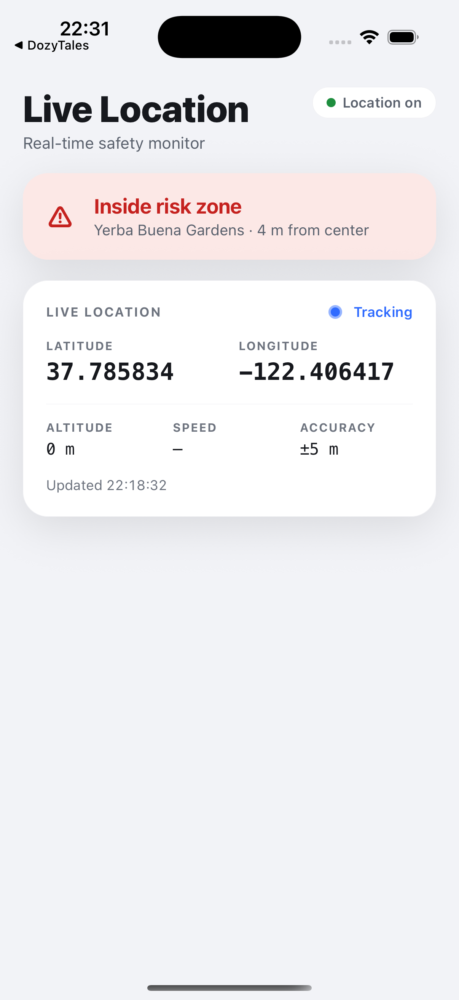

# expo-live-location

Real-time iOS location for React Native. The device logic lives in a pure Swift
package (`LiveLocationKit`) with no Expo or React Native dependency, handed out as
a single `AsyncStream<LocationSample>`. The Expo layer is a thin adapter: it moves
values across the JS bridge and starts or stops the stream based on who's
listening. No location logic in the bridge. The core builds and tests on its own,
no simulator needed.

<p align="center">
  
</p>

## Highlights

- `LiveLocationKit` is a standalone Swift package. It builds and tests with
  `swift test` (mock only) and can be reused from any Swift target.
- `liveUpdates()` is the primary path on iOS 17+, with a `CLLocationManagerDelegate`
  fallback for iOS 16. Both come out of one `AsyncStream`, so callers never branch
  on OS version.
- DI through the `LocationSourcing` protocol, so the whole stack runs against a mock
  in tests.
- The native source only runs while JavaScript holds a listener.
- Fully typed TypeScript (no `any`) and a `useLiveLocation()` hook that handles
  subscription and cleanup.
- Risk-zone monitoring: a pure `RiskMonitor` emits `entered`, `exited`, and
  `approaching` events as the device crosses circular zones. No network, no maps.

## Architecture

```
        ┌──────────────────────────────────────────────────────────────┐
        │  Apple CoreLocation                                          │
        │  CLLocationUpdate.liveUpdates() · CLLocationManagerDelegate  │
        └───────────────────────────────┬──────────────────────────────┘
                                        │  (CoreLocation confined here)
        ┌───────────────────────────────▼──────────────────────────────┐
        │  SystemLocationSource            : LocationSourcing          │
        │  bridges both OS paths into one AsyncStream<LocationSample>  │
        └───────────────────────────────┬──────────────────────────────┘
                                        │  LocationSourcing  (DI seam)
        ┌───────────────────────────────▼──────────────────────────────┐
        │  LiveLocationProvider            — public entry point        │   pure Swift,
        │  thin, injectable, AsyncStream<LocationSample> out           │   no Expo / RN
        └───────────────────────────────┬──────────────────────────────┘
        ─ ─ ─ ─ ─ ─ ─ ─ ─ ─ ─ ─ ─ ─ ─ ─ ┼ ─ ─ ─ ─ ─ ─ ─ ─ ─ ─ ─ ─ ─ ─ ─   package boundary
        ┌───────────────────────────────▼──────────────────────────────┐
        │  ExpoLiveLocationModule          — thin Expo adapter         │
        │  Sample↔Record mapping · Events · OnStart/OnStopObserving    │
        └───────────────────────────────┬──────────────────────────────┘
                                        │  native module bridge
        ┌───────────────────────────────▼──────────────────────────────┐
        │  useLiveLocation()               — React hook                │
        │  subscribes on mount, removes listener + stops on unmount    │
        └──────────────────────────────────────────────────────────────┘
```

Type translation stays in dedicated seams. `LocationSample ↔ CLLocation` and
`LocationSample ↔ Expo Record` each live in one file, the risk bridge
(`RiskEvent`/`RiskZone ↔ Expo Record`) in another. CoreLocation is imported in two
files, Expo only under `ios/`.

## Usage

```tsx
import { useLiveLocation } from 'expo-live-location';
import { Text, View } from 'react-native';

export default function Screen() {
  const { location, permission, error } = useLiveLocation();

  if (error) return <Text>{error.message}</Text>;
  if (permission !== 'granted') return <Text>Permission: {permission ?? '…'}</Text>;
  if (!location) return <Text>Waiting for first fix…</Text>;

  return (
    <View>
      <Text>{location.latitude.toFixed(6)}, {location.longitude.toFixed(6)}</Text>
      <Text>±{location.horizontalAccuracy.toFixed(0)} m</Text>
    </View>
  );
}
```

There's a typed imperative API if you'd rather skip the hook: `requestPermission()`,
`getCurrentLocation()`, `startUpdates()`/`stopUpdates()`, and
`addListener('onLocationUpdate', …)`.

Add `NSLocationWhenInUseUsageDescription` to your Info.plist. The `example/` app
sets it through `app.json`.

### Risk zones

Pass circular zones to monitor and the hook reports the latest crossing on `risk`:

```tsx
import { useLiveLocation, type RiskZone } from 'expo-live-location';

const zones: RiskZone[] = [
  { name: 'Harbor District', latitude: 37.3349, longitude: -122.009, radius: 600 },
];

function Screen() {
  const { location, risk } = useLiveLocation({ riskZones: zones });
  // risk?.kind is 'entered' | 'exited' | 'approaching'; risk?.distance is meters.
}
```

Imperatively it's `setRiskZones([...])` plus an `onRiskAlert` listener.

Inside the radius counts as inside (`entered`/`exited`). Within a configurable
margin past the radius it's approaching. Events fire only on crossings, so a
stationary device alerts once and then goes quiet. Distance is great-circle math
through CoreLocation, all offline.

## Design decisions

Two OS strategies, one stream. `liveUpdates()` leads (clean async sequence,
automatic cancellation) and the iOS 16 delegate fallback gets bridged into an
`AsyncStream` of the same type, so every consumer writes one loop. Errors get a
real home rather than a non-throwing stream: `requestAuthorization()` and the
one-shot `currentLocation()` throw a typed `LocationError`, and the update stream
just finishes when it can't produce values.

Lifecycle follows listeners. `OnStartObserving`/`OnStopObserving` start and stop
the stream as listeners come and go, so location services never run with nothing
consuming them. One `Task` reference is the source of truth, and
`startUpdates()`/`stopUpdates()` go through the same path, so they can't
double-start or leak.

## Project layout

```
LiveLocationKit/               Standalone Swift package (the core).
  Package.swift                cd in and run swift test.
  Sources/LiveLocationKit/     Domain types, LocationSourcing, SystemLocationSource,
                               LiveLocationProvider, RiskMonitor/RiskZone/RiskEvent.
  Tests/LiveLocationKitTests/  MockLocationSource and the behavioral tests.
ios/                           Thin Expo adapter: the module and the Record mapping.
ExpoLiveLocation.podspec       Pod manifest (repo root, see below).
src/                           TypeScript surface and the useLiveLocation hook.
example/                       Runnable Expo app that consumes the module.
```

The core is its own package, so it builds and tests with no app and no simulator.
The Expo pod compiles the same files in place rather than copying them. CocoaPods
only globs files under the podspec's own directory, so the podspec sits at the
repo root where its pod directory covers both `ios/` and the Kit, and
`apple.podspecPath` in `expo-module.config.json` points autolinking at it. One
canonical copy, compiled two ways, importing nothing from Expo.

## Building and testing

Run the unit tests from the package:

```bash
cd LiveLocationKit
swift test            # mock only, deterministic, no simulator
```

`swift test` needs the Xcode toolchain for XCTest. If `xcode-select` points at the
Command Line Tools, prefix it with
`DEVELOPER_DIR=/Applications/Xcode.app/Contents/Developer`.

What's covered:

- Domain types, `LocationSourcing`, and `LiveLocationProvider`, all through the mock.
- Risk monitoring (`RiskMonitor`, `RiskZone`, `proximity`) with scripted coordinates:
  enter/exit/approach, no spam while stationary, independent zones, the distance math.
- `SystemLocationSource` compiles under Swift 6 strict concurrency but isn't
  unit-tested, since its live CoreLocation behavior needs a device.
- The TypeScript surface compiles to `build/` with `npm run build` (`tsc`, strict).
- The Expo adapter under `ios/` only builds inside an app that installs
  `ExpoModulesCore`, so build the example to compile it.

## Running the example

`example/` is a self-contained Expo app that picks up the module through
autolinking (`expo.autolinking.nativeModulesDir: ".."`).

```bash
npm install && npm run build      # build the module's JS to build/
cd example
npm install
npx expo run:ios                  # prebuild, pod install, launch
```

`npx expo run:ios` needs a full Xcode install, not just the Command Line Tools.
The app declares `NSLocationWhenInUseUsageDescription`, so iOS prompts for
permission on first launch.

It monitors three demo zones around the simulator's default San Francisco location.
A fresh simulator starts inside one, so you get **Inside risk zone** on the first
fix (that's the screenshot above).

To watch it transition, drive the bundled `example/route.gpx` through the zones
(Xcode ▸ Debug ▸ Simulate Location ▸ Add GPX File to Workspace…, pick `route`).
No Xcode? Move a booted simulator from the command line:

```bash
# Jump to a single state:
xcrun simctl location booted set 37.7858,-122.4064    # Inside      (red)
xcrun simctl location booted set 37.7896,-122.4103    # Approaching (amber)
xcrun simctl location booted set 37.7780,-122.3920    # All clear   (green)

# Drive the full Inside -> clear -> Approaching -> Inside -> clear loop:
xcrun simctl location booted start --speed=12 \
  37.785800,-122.406400 37.789573,-122.410152 37.792088,-122.412653 \
  37.794603,-122.415154
```

## Requirements

- iOS 16+
- Expo SDK 56+

## License

MIT, see [LICENSE](./LICENSE).
